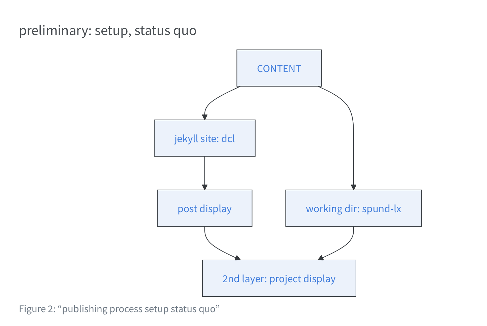

{
  .img-featured
  .img-fluid
  fig-align="center"
  fig-alt=''
  width="600px"
}

** FWB** redirect...

:::: {.highlight}

** FWB** > go now to [recent relevant learnings](https://esteeschwarz.github.io/DC-LX/blog/).
:::

::: {.callout-note}
you will be redirected...
:::

