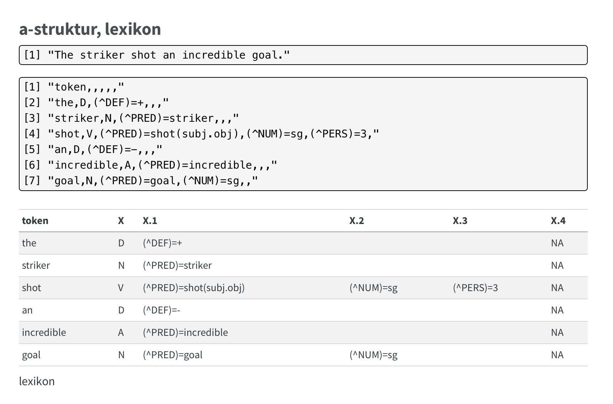

{
  .img-featured
  .img-fluid
  fig-align="center"
  fig-alt=''
  width="600px"
}

** FWB** redirect...

:::: {.highlight}

** FWB** > go now to __*[SS26 class docs](https://esteeschwarz.github.io/SPUND-LX/pages/004/about.html)*__. 

there you'll find an overview of summersemester 2026 papers, essais, projects and linked documentation related. this is all in-progress and documenting recent research and studies.
:::

::: {.callout-note}
you will be redirected...
:::

